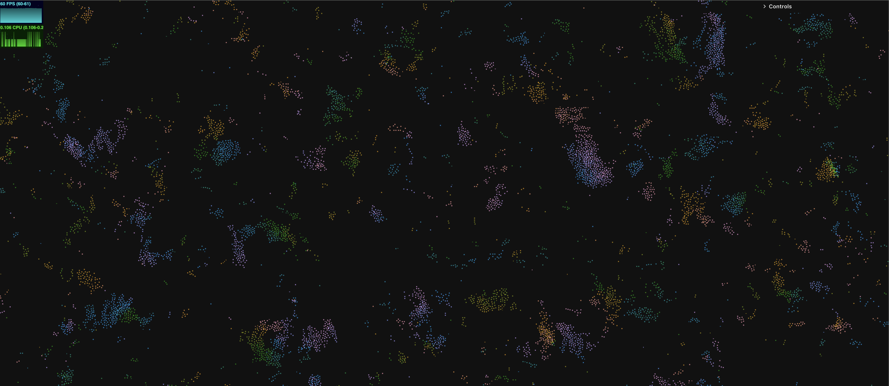

## WebGPU Boids 

**Tweet:** https://x.com/anuraghazru/status/1936080956282052618

### Controls

- Mouse wheel to zoom in and out.
- Hold **Control** to apply a repelling force on nearby boids.
- **Shift + Click + Drag** to move the camera view.
- Use the GUI to tweak the parameters.

### Optimizations

- Massive number of boids *(100k to 500k depending on system).*
- 100% on the GPU via compute shaders.
- Spatial hashing for efficient neighbor lookup.
- Instanced rendering of particles.

### Wanna see more boids?

Check out my other project - [Evolution Aquarium](https://github.com/anuraghazra/EvolutionAquerium)!